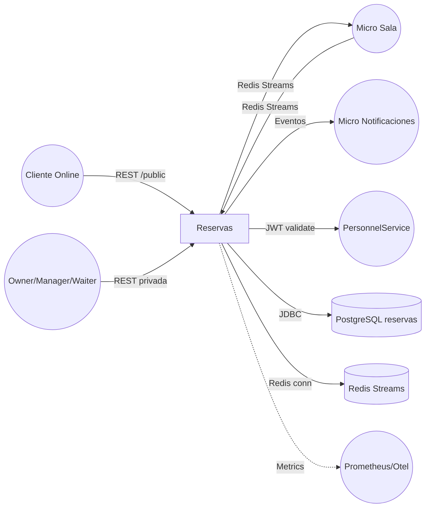

# 📘 Fase 1 — Arquitectura & Domain Blueprint (Reservas Service)

## 1. Alcance y objetivo
- **Misión**: convertir los requisitos funcionales del micro de Reservas en un blueprint técnico ejecutable para las fases 2–6 del roadmap.
- **Entradas**: `docs/reservas/base.md`, `reservas-service-SPEC.md`, `reservas-schema.sql`, lineamientos globales Suances.
- **Stack decidido**: Spring Boot 3.5.11 (Java 21), arquitectura hexagonal, PostgreSQL, Redis Streams, JWT (issuer `personnel-service`), Micrometer + OpenTelemetry.

## 2. Contexto y límites del micro



**Límites**
- Todo el modelado de salas, mesas, franjas, reservas, bloqueos y waitlist pertenece a `reservas-service`.
- Interacción con otros micros únicamente mediante: 1) REST autenticado para usuarios internos, 2) API pública acotada, 3) eventos Redis Streams (`sala.events`, `reservas.events`).
- No persiste datos de pagos ni catálogo (derivado a otros micros); solo conserva IDs necesarios en auditoría/eventos.

## 3. Contratos REST iniciales

### 3.1 Autenticación & headers
- `Authorization: Bearer <JWT>` obligatorio en endpoints privados (roles OWNER, MANAGER, WAITER).
- `Content-Type: application/json`. Endpoints públicos admiten rate limiting por IP (config futura).

### 3.2 Configuración estructural (Salas/Mesas)

| Método | Endpoint | Roles | Resumen |
| --- | --- | --- | --- |
| POST | `/salas` | OWNER | Crea sala con layout básico.
| GET | `/salas` | OWNER, MANAGER | Lista salas activas/inactivas.
| GET | `/salas/{id}` | OWNER, MANAGER | Detalle + layout.
| PUT | `/salas/{id}` | OWNER | Actualiza nombre/capacidad/layout.
| DELETE | `/salas/{id}` | OWNER | Desactiva (soft delete).
| POST | `/salas/{salaId}/mesas` | OWNER | Crea mesa (número único en sala).
| GET | `/salas/{salaId}/mesas` | OWNER, MANAGER | Lista con filtros estado.
| PATCH | `/mesas/{id}` | OWNER | Cambia capacidad/posición/visibilidad.

**Ejemplo POST /salas**
```json
{
  "nombre": "Principal",
  "capacidadMaxima": 60,
  "layout": {
    "ancho": 500,
    "alto": 300,
    "vertices": [[0,0],[500,0],[500,300],[0,300]]
  }
}
```

### 3.3 Franjas

| Método | Endpoint | Roles | Resumen |
| --- | --- | --- | --- |
| POST | `/franjas` | OWNER | Nueva franja (horaInicio/horaFin, tipo, activa).
| GET | `/franjas` | OWNER, MANAGER | Listado completo.
| PUT | `/franjas/{id}` | OWNER | Actualiza horarios/estado.
| DELETE | `/franjas/{id}` | OWNER | Soft delete.

### 3.4 Reservas privadas (backoffice)

| Método | Endpoint | Roles | Resumen |
| --- | --- | --- | --- |
| GET | `/reservas` | OWNER, MANAGER | Listado paginado con filtros fecha/franja/estado.
| POST | `/reservas` | OWNER, MANAGER | Crea reserva manual (permite `force=true`).
| PATCH | `/reservas/{id}` | OWNER, MANAGER | Modifica comensales, mesa, datos contacto.
| POST | `/reservas/{id}/confirmar` | OWNER, MANAGER, WAITER | Marca llegada.
| POST | `/reservas/{id}/noshow` | OWNER, MANAGER, WAITER | Marca no show.
| DELETE | `/reservas/{id}` | OWNER, MANAGER | Cancela y libera mesa.

### 3.5 API pública (clientes)

| Método | Endpoint | Resumen |
| --- | --- | --- |
| POST | `/public/reservas/consultar` | Devuelve franjas/mesas disponibles por fecha.
| POST | `/public/reservas` | Crea reserva ONLINE en estado `PENDIENTE`.
| GET | `/public/reservas/{codigo}` | Consulta estado por código.

**Ejemplo POST /public/reservas**
```json
{
  "fecha": "2026-03-05",
  "franjaId": "uuid-franja",
  "comensales": 4,
  "nombre": "Laura",
  "telefono": "+34 600000000",
  "email": "laura@correo.com",
  "preferencias": "Ventana"
}
```

**Response 201**
```json
{
  "codigo": "RSV-9F3A",
  "estado": "PENDIENTE",
  "mesaAsignada": 12,
  "fecha": "2026-03-05",
  "franja": {
    "id": "uuid",
    "horaInicio": "13:00",
    "horaFin": "14:30"
  }
}
```

### 3.6 Waitlist y bloqueos

| Método | Endpoint | Roles | Resumen |
| --- | --- | --- | --- |
| GET | `/waitlist` | OWNER, MANAGER | Lista cola por fecha/franja.
| POST | `/waitlist/{entryId}/notificar` | OWNER, MANAGER | Dispara notificación.
| DELETE | `/waitlist/{entryId}` | OWNER, MANAGER | Elimina entrada.
| POST | `/mesas/{id}/bloqueos` | OWNER, MANAGER | Crea bloqueo manual (ONLINE/TOTAL).
| DELETE | `/mesas/{id}/bloqueos/{bloqueoId}` | OWNER, MANAGER | Libera bloqueo.

## 4. Contratos de eventos Redis Streams

### Entrantes (`sala.events`)
```json
{
  "eventId": "uuid",
  "type": "sala.order.started",
  "timestamp": "2026-03-05T13:05:00Z",
  "data": {
    "mesaId": "uuid",
    "fecha": "2026-03-05",
    "hora": "13:05",
    "comandaId": "uuid"
  }
}
```
Acciones: marcar mesa `OCUPADA`, crear bloqueo `EVENTO_AUTO`, notificar conflicto.

`sala.order.closed` libera mesa/bloqueo si no existe reserva activa.

### Salientes (`reservas.events`)

| Tipo | Consumidores | Datos clave |
| --- | --- | --- |
| `reserva.created` | Notificaciones, Sala, Analytics | Estado, mesa, contacto, origen.
| `reserva.updated` | Sala | Cambios en mesa/franja/estado.
| `reserva.cancelled` | Notificaciones | Motivo, código, mesa liberada.
| `mesa.blocked` | Sala | MesaId, rango temporal, motivo.
| `mesa.released` | Sala | MesaId, franja liberada.
| `waitlist.promoted` | Notificaciones | Datos cliente, nueva reserva.

Formato común:
```json
{
  "eventId": "uuid",
  "type": "reserva.created",
  "timestamp": "2026-03-05T11:00:00Z",
  "data": { ... },
  "metadata": {
    "traceId": "",
    "source": "reservas-service"
  }
}
```

## 5. Historias técnicas priorizadas
1. `ARCH-01` Bootstrap Spring Boot + configs (Redis, Security, OpenAPI, observabilidad mínima).
2. `ARCH-02` Modelado dominio Sala/Mesa/Franja/Reserva/Bloqueo/Waitlist + repositorios JPA + constraints RN1–RN6.
3. `ARCH-03` Casos de uso configuración (CRUD salas/mesas/franjas) con validaciones layout y numeración.
4. `ARCH-04` Motor `AllocationEngine` (filtros capacidad, bloqueos, visibilidad) + tests unitarios.
5. `ARCH-05` API pública reservas + waitlist (DTOs, validaciones Bean Validation, rate limiting configurable).
6. `ARCH-06` API privada reservas manuales, confirmación/no-show, auditoría `reserva_audit`.
7. `ARCH-07` Gestión bloqueos manuales/automáticos + consumer Redis Sala + reconciliación.
8. `ARCH-08` Productor eventos `reservas.events` + tabla `eventos_procesados` para idempotencia.
9. `ARCH-09` Observabilidad (métricas `reservas_total`, `waitlist_size`, `allocation_time_ms`, `events_lag_ms`) y alertas base.

## 6. Riesgos y mitigaciones

| Riesgo | Impacto | Mitigación |
| --- | --- | --- |
| R1: Divergencia con micro Sala (eventos perdidos) | Overbooking o mesas bloqueadas de más | Consumer con `auto-claim`, registro en `eventos_procesados`, métrica `events_lag_ms` + alertas |
| R2: Carreras entre reservas manuales y online | Doble asignación mesa | Constraint único `(mesa_id, fecha, franja_id)`, transacciones serializables, reintentos AllocationEngine |
| R3: JWT inválidos/rotaciones | Bloqueo de API privada | Config caché JWKS/secret, feature flag modo mantenimiento, logs específicos security |
| R4: Waitlist sin notificación | Experiencia cliente pobre | Integración temprana con Notificaciones vía `waitlist.promoted`, fallback email manual |
| R5: Bloqueos automáticos eternos | Mesas inaccesibles | TTL configurable para bloqueos `EVENTO_AUTO`, job reconciliación diaria |

## 7. Dependencias externas formalizadas
- **Micro Sala**: publica `sala.order.*`, consume `mesa.blocked`, `mesa.released`, `reserva.*`. Se requiere contrato Pact/eventos y entorno Redis compartido.
- **Micro Notificaciones**: suscribe `reserva.created/updated/cancelled`, `waitlist.promoted`; necesita payload contacto + preferencia canal.
- **PersonnelService/Auth**: emite JWT HS256 (`iss=personnel-service`, `aud=reservas-service`). Requiere secreto compartido o JWKS endpoint.
- **Infra común**: PostgreSQL `localhost:5432/reservas`, Redis `localhost:6379`, Prometheus/Otel collector para métricas/tracing.

## 8. Hand-off y próximos pasos
- Blueprint aprobado habilita la **Fase 2 (Infra & Scaffold)**: crear repo `apps/reservas-service`, configurar Maven/Spring Boot, Docker Compose con PostgreSQL/Redis y pipelines mínimos.
- Recomendación: conservar este archivo como referencia viva; cambios de alcance futuros deben versionarse aquí antes de impactar fases posteriores.

> Definition of Done cumplido: contexto definido, contratos iniciales con ejemplos, historias técnicas priorizadas, riesgos + mitigaciones explicitados y dependencias externas formalizadas.
