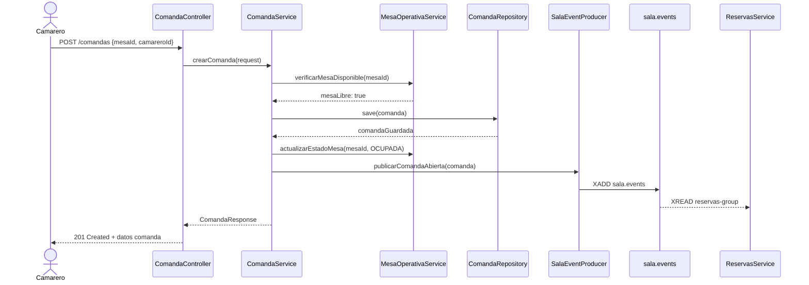
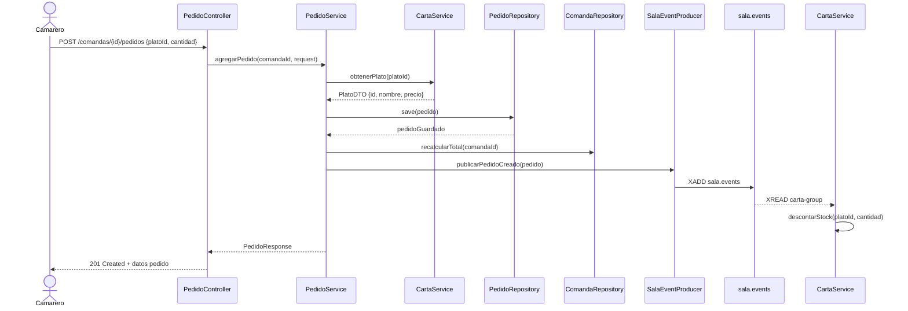
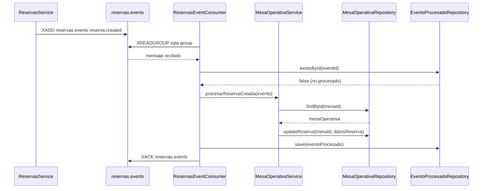
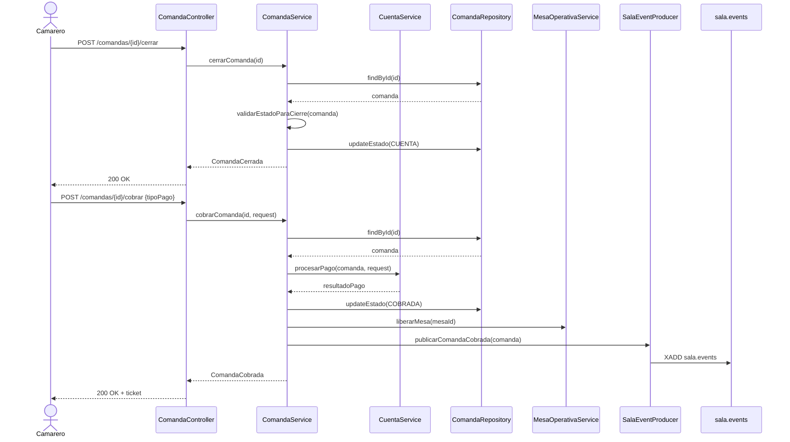

# Arquitectura y Diagramas - Sala Service

## 1. Arquitectura General

### 1.1 Diagrama de Componentes

```
┌─────────────────────────────────────────────────────────────────────────────┐
│                           REST-SALA-SERVICE                                 │
│                              (Puerto 8083)                                  │
├─────────────────────────────────────────────────────────────────────────────┤
│                                                                             │
│  ┌─────────────────────────────────────────────────────────────────────┐   │
│  │                        API Layer (Controllers)                      │   │
│  │  ┌─────────────┐ ┌─────────────┐ ┌─────────────┐ ┌─────────────┐   │   │
│  │  │   Comanda   │ │   Pedido    │ │    Mesa     │ │   Cuenta    │   │   │
│  │  │ Controller  │ │ Controller  │ │ Controller  │ │ Controller  │   │   │
│  │  └──────┬──────┘ └──────┬──────┘ └──────┬──────┘ └──────┬──────┘   │   │
│  └─────────┼───────────────┼───────────────┼───────────────┼──────────┘   │
│            │               │               │               │               │
│            ▼               ▼               ▼               ▼               │
│  ┌─────────────────────────────────────────────────────────────────────┐   │
│  │                     Service Layer (Lógica)                          │   │
│  │  ┌─────────────┐ ┌─────────────┐ ┌─────────────┐ ┌─────────────┐   │   │
│  │  │   Comanda   │ │   Pedido    │ │ MesaOperativa│ │   Cuenta    │   │   │
│  │  │   Service   │ │   Service   │ │   Service   │ │   Service   │   │   │
│  │  └──────┬──────┘ └──────┬──────┘ └──────┬──────┘ └──────┬──────┘   │   │
│  └─────────┼───────────────┼───────────────┼───────────────┼──────────┘   │
│            │               │               │               │               │
│            ▼               ▼               ▼               ▼               │
│  ┌─────────────────────────────────────────────────────────────────────┐   │
│  │                   Repository Layer (JPA)                            │   │
│  │  ┌─────────────┐ ┌─────────────┐ ┌─────────────┐ ┌─────────────┐   │   │
│  │  │   Comanda   │ │   Pedido    │ │    Mesa     │ │   Evento    │   │   │
│  │  │  Repository │ │  Repository │ │  Repository │ │  Repository │   │   │
│  │  └──────┬──────┘ └──────┬──────┘ └──────┬──────┘ └──────┬──────┘   │   │
│  └─────────┼───────────────┼───────────────┼───────────────┼──────────┘   │
│            │               │               │               │               │
│            ▼               ▼               ▼               ▼               │
│  ┌─────────────────────────────────────────────────────────────────────┐   │
│  │                      PostgreSQL (Port 5432)                         │   │
│  │          Database: sala                                             │   │
│  └─────────────────────────────────────────────────────────────────────┘   │
│                                                                             │
│  ┌─────────────────────────────────────────────────────────────────────┐   │
│  │                    Event Layer (Redis Streams)                      │   │
│  │                                                                     │   │
│  │  ┌──────────────────┐          ┌──────────────────┐                │   │
│  │  │ ReservasEvent    │          │ SalaEvent        │                │   │
│  │  │ Consumer         │          │ Producer         │                │   │
│  │  │ (Entrada)        │          │ (Salida)         │                │   │
│  │  └────────┬─────────┘          └────────┬─────────┘                │   │
│  │           │                             │                          │   │
│  └───────────┼─────────────────────────────┼──────────────────────────┘   │
│              │                             │                                │
└──────────────┼─────────────────────────────┼────────────────────────────────┘
               │                             │
               ▼                             ▼
┌──────────────────────────┐    ┌──────────────────────────┐
│  reservas.events         │    │  sala.events             │
│  (Redis Stream)          │    │  (Redis Stream)          │
└──────────┬───────────────┘    └──────────┬───────────────┘
           │                               │
           │ Entrantes                     │ Salientes
           │                               │
    ┌──────▼──────┐               ┌────────▼──────┐
    │  Reservas   │               │   Reservas    │
    │   Service   │               │    Service    │
    └─────────────┘               └───────────────┘
                                  ┌───────────────┐
                                  │    Carta      │
                                  │   Service     │
                                  └───────────────┘
```

### 1.2 Diagrama de Flujo de Datos

```
┌─────────────┐     HTTP      ┌──────────────────┐     SQL      ┌─────────────┐
│   Cliente   │──────────────▶│  Sala Service    │─────────────▶│ PostgreSQL  │
│  (App Web)  │               │                  │              │   (sala)    │
└─────────────┘               └──────────────────┘              └─────────────┘
                                     │
                                     │ Eventos
                                     ▼
                              ┌──────────────────┐
                              │  Redis Streams   │
                              └──────────────────┘
                                     │
                    ┌────────────────┼────────────────┐
                    │                │                │
                    ▼                ▼                ▼
            ┌──────────────┐ ┌──────────────┐ ┌──────────────┐
            │   Reservas   │ │    Carta     │ │  Notificac.  │
            │   Service    │ │   Service    │ │   (futuro)   │
            └──────────────┘ └──────────────┘ └──────────────┘
```

---

## 2. Diagramas de Secuencia

### 2.1 Abrir Comanda



### 2.2 Agregar Pedido



### 2.3 Consumir Evento de Reserva



### 2.4 Cerrar y Cobrar Comanda



---

## 3. Diagrama de Estados

### 3.1 Estados de Comanda

```
                         ┌─────────────────┐
                         │    ABIERTA      │
                         │  (Nueva)        │
                         └────────┬────────┘
                                  │
                    ┌─────────────┼─────────────┐
                    │             │             │
                    ▼             │             ▼
           ┌────────────────┐     │    ┌────────────────┐
           │ EN_PREPARACION │     │    │   CANCELADA    │
           │ (1er pedido    │     │    │ (Sin pedidos   │
           │  en preparar)  │     │    │   servidos)    │
           └────────┬───────┘     │    └────────────────┘
                    │             │
                    │             │ Agregar más pedidos
                    │             │
                    ▼             ▼
           ┌────────────────┐
           │    SERVIDA     │
           │ (Todos pedidos │
           │   servidos)    │
           └────────┬───────┘
                    │
                    │ Cliente pide cuenta
                    ▼
           ┌────────────────┐     ┌────────────────┐
           │     CUENTA     │◄────┤  (Agregar más  │
           │   (Listo para  │     │    pedidos)    │
           │    cobrar)     │     └────────────────┘
           └────────┬───────┘
                    │
                    │ Cobro procesado
                    ▼
           ┌────────────────┐
           │    COBRADA     │
           │   (Finalizada) │
           └────────────────┘
```

### 3.2 Estados de Pedido

```
┌─────────────────┐
│    PENDIENTE    │
│   (Nuevo)       │
└────────┬────────┘
         │
         │ Cocina inicia
         ▼
┌─────────────────────┐
│   EN_PREPARACION    │
│   (Cocinando)       │
└────────┬────────────┘
         │
         │ Plato listo
         ▼
┌─────────────────┐
│     LISTO       │
│  (Para servir)  │
└────────┬────────┘
         │
         │ Camarero sirve
         ▼
┌─────────────────┐
│    SERVIDO      │
│  (Entregado)    │
└─────────────────┘

┌─────────────────┐
│   CANCELADO     │
│  (Cancelado     │
│   antes de      │
│   servir)       │
└─────────────────┘
```

### 3.3 Estados de Mesa Operativa

```
┌────────────────────────────────────────────────────────────────────────────┐
│                             ESTADOS DE MESA                                │
└────────────────────────────────────────────────────────────────────────────┘

                        ┌───────────────┐
                        │     LIBRE     │
                        │  (Disponible) │
                        └───────┬───────┘
                                │
           ┌────────────────────┼────────────────────┐
           │                    │                    │
           │ Cliente llega      │ Reserva creada     │
           │ (sin reserva)      │                    │
           ▼                    ▼                    │
  ┌─────────────────┐  ┌─────────────────┐           │
  │     OCUPADA     │  │   RESERVADA     │           │
  │ (Con comanda    │  │ (Reserva activa │           │
  │   abierta)      │  │  sin comanda)   │           │
  └────────┬────────┘  └────────┬────────┘           │
           │                    │                    │
           │ Primeros           │ Cliente llega      │
           │ pedidos            │                    │
           ▼                    ▼                    │
  ┌─────────────────┐  ┌─────────────────┐          │
  │    PIDIENDO     │  │     OCUPADA     │          │
  │ (Tomando pedido)│  │                 │          │
  └────────┬────────┘  └─────────────────┘          │
           │                                         │
           │ Pedidos listos                          │
           ▼                                         │
  ┌─────────────────┐                                │
  │     SERVIDA     │                                │
  │(Todos servidos) │                                │
  └────────┬────────┘                                │
           │                                         │
           │ Cliente pide cuenta                     │
           ▼                                         │
  ┌─────────────────┐                                │
  │     CUENTA      │                                │
  │ (Esperando pago)│                                │
  └────────┬────────┘                                │
           │                                         │
           │ Pago procesado                          │
           ▼                                         │
  ┌─────────────────┐                                │
  │    COBRADA      │◄───────────────────────────────┘
  │    (Pagada)     │
  └────────┬────────┘
           │
           │ Mesa limpiada
           ▼
  ┌─────────────────┐
  │     LIBRE       │
  └─────────────────┘
```

---

## 4. Modelo de Datos

### 4.1 Diagrama Entidad-Relación

```
┌─────────────────────────────────────────────────────────────────────────────┐
│                              ENTIDADES PRINCIPALES                          │
└─────────────────────────────────────────────────────────────────────────────┘

┌─────────────────────┐       ┌─────────────────────┐
│     COMANDAS        │       │      PEDIDOS        │
├─────────────────────┤       ├─────────────────────┤
│ PK id               │       │ PK id               │
│    mesa_id          │       │ FK comanda_id       │◄───────────┐
│    camarero_id      │◄──────┤    plato_id         │            │
│    codigo           │       │    cantidad         │            │
│    estado           │       │    precio_unitario  │            │
│    numero_comensales│       │    estado           │            │
│    total            │       │    notas            │            │
│    fecha_apertura   │       │    hora_pedido      │            │
│    fecha_cierre     │       │    hora_listo       │            │
│    created_at       │       │    hora_servido     │            │
└─────────────────────┘       └─────────────────────┘            │
          │                                                      │
          │ 1:N                                                  │
          └──────────────────────────────────────────────────────┘

┌─────────────────────┐
│  MESAS_OPERATIVAS   │
├─────────────────────┤
│ PK id               │◄─── Mismo ID que reservas-service
│    numero           │
│    sala_id          │
│    estado_operativo │
│ FK comanda_activa_id│
│    camarero_id      │
│    reserva_id       │
└─────────────────────┘

┌─────────────────────┐
│ EVENTOS_PROCESADOS  │
├─────────────────────┤
│ PK event_id         │
│    processed_at     │
│    tipo_evento      │
│    origen           │
└─────────────────────┘
```

### 4.2 Relaciones

```
COMANDA 1───N PEDIDO
    │
    │ 1:1 (cuando activa)
    ▼
MESA_OPERATIVA 1───1 (opcional) COMANDA (comanda_activa_id)

EVENTOS_PROCESADOS es independiente (para idempotencia)
```

---

## 5. Arquitectura de Eventos

### 5.1 Flujo de Eventos Completo

```
┌─────────────────────────────────────────────────────────────────────────────┐
│                           FLUJO DE EVENTOS                                  │
└─────────────────────────────────────────────────────────────────────────────┘

Escenario: Cliente con reserva llega al restaurante

1. RESERVA CREADA (previamente)
   ┌─────────────────┐
   │ reservas-service│
   └────────┬────────┘
            │ XADD reservas.events
            │ reserva.created
            ▼
   ┌─────────────────┐
   │  sala-service   │ ◄── ReservasEventConsumer
   │                 │     procesa y bloquea mesa
   └─────────────────┘

2. APERTURA DE COMANDA
   ┌─────────────────┐
   │  camarero-app   │
   └────────┬────────┘
            │ POST /comandas
            ▼
   ┌─────────────────┐
   │  sala-service   │
   │                 │
   └────────┬────────┘
            │ XADD sala.events
            │ sala.comanda.abierta
            ▼
   ┌─────────────────┐       ┌─────────────────┐
   │ reservas-service│       │   analytics     │
   └─────────────────┘       └─────────────────┘

3. PEDIDO REALIZADO
   ┌─────────────────┐
   │  camarero-app   │
   └────────┬────────┘
            │ POST /pedidos
            ▼
   ┌─────────────────┐
   │  sala-service   │
   │                 │
   └────────┬────────┘
            │ XADD sala.events
            │ sala.pedido.creado
            ▼
   ┌─────────────────┐
   │  carta-service  │ ◄── Descontar stock
   │                 │     Verificar umbral
   └────────┬────────┘
            │ XADD carta.events (si aplica)
            │ ingrediente.stock.bajo
            ▼
   ┌─────────────────┐
   │  sala-service   │ ◄── Mostrar alerta
   └─────────────────┘

4. PEDIDO LISTO
   ┌─────────────────┐
   │   cocina-app    │
   └────────┬────────┘
            │ PATCH /pedidos/{id}/estado
            │ (EN_PREPARACION → LISTO)
            ▼
   ┌─────────────────┐
   │  sala-service   │
   └────────┬────────┘
            │ XADD sala.events
            │ sala.pedido.estado-cambiado
            ▼
   ┌─────────────────┐       ┌─────────────────┐
   │  camarero-app   │       │ dashboard-mesas │
   │  (notificación) │       │  (actualización)│
   └─────────────────┘       └─────────────────┘

5. CLIENTE PIDE CUENTA
   ┌─────────────────┐
   │  camarero-app   │
   └────────┬────────┘
            │ POST /comandas/{id}/cerrar
            ▼
   ┌─────────────────┐
   │  sala-service   │
   └────────┬────────┘
            │ XADD sala.events
            │ sala.cuenta.cerrada
            ▼
   ┌─────────────────┐
   │ reservas-service│
   └─────────────────┘

6. COBRO PROCESADO
   ┌─────────────────┐
   │  camarero-app   │
   └────────┬────────┘
            │ POST /comandas/{id}/cobrar
            ▼
   ┌─────────────────┐
   │  sala-service   │
   │                 │
   └────────┬────────┘
            │ XADD sala.events
            │ sala.comanda.cobrada
            │ sala.mesa.estado-cambiado (→ LIBRE)
            ▼
   ┌─────────────────┐       ┌─────────────────┐
   │   analytics     │       │ reservas-service│
   └─────────────────┘       └─────────────────┘
```

---

## 6. Infraestructura

### 6.1 Docker Compose

```yaml
version: "3.9"

services:
  sala-db:
    image: postgres:16
    container_name: sala-db
    restart: unless-stopped
    environment:
      POSTGRES_DB: sala
      POSTGRES_USER: postgres
      POSTGRES_PASSWORD: postgres
    ports:
      - "5433:5432"
    volumes:
      - sala-db-data:/var/lib/postgresql/data
      - ./init.sql:/docker-entrypoint-initdb.d/init.sql

  sala-redis:
    image: redis:7-alpine
    container_name: sala-redis
    restart: unless-stopped
    ports:
      - "6381:6379"

  sala-service:
    build: .
    container_name: sala-service
    depends_on:
      - sala-db
      - sala-redis
    env_file:
      - .env
    ports:
      - "8083:8083"
    environment:
      SPRING_DATASOURCE_URL: jdbc:postgresql://sala-db:5432/sala
      SPRING_DATASOURCE_USERNAME: postgres
      SPRING_DATASOURCE_PASSWORD: postgres
      SPRING_DATA_REDIS_HOST: sala-redis

volumes:
  sala-db-data:
```

### 6.2 Integración con Infraestructura Global

```
┌─────────────────────────────────────────────────────────────────────────────┐
│                      INFRAESTRUCTURA SUANCES                                │
└─────────────────────────────────────────────────────────────────────────────┘

                                    ┌──────────────────┐
                                    │    PostgreSQL    │
                                    │     Cluster      │
                                    │  (Puerto 5432)   │
                                    └────────┬─────────┘
                                             │
         ┌───────────────────┬───────────────┼───────────────┬───────────────────┐
         │                   │               │               │                   │
         ▼                   ▼               ▼               ▼                   ▼
┌──────────────────┐ ┌──────────────────┐ ┌──────────────────┐ ┌──────────────────┐
│  carta-service   │ │personal-service  │ │reservas-service  │ │   sala-service   │
│     :8081        │ │     :8085        │ │     :8087        │ │     :8083        │
│    DB: carta     │ │   DB: personal   │ │  DB: reservas    │ │    DB: sala      │
└────────┬─────────┘ └──────────────────┘ └────────┬─────────┘ └────────┬─────────┘
         │                                         │                    │
         │                                         │                    │
         └──────────────────┬──────────────────────┘                    │
                            │                                           │
                            ▼                                           ▼
                   ┌──────────────────┐                       ┌──────────────────┐
                   │  Redis Streams   │◄──────────────────────│ sala-service     │
                   │    (Port 6379)   │   reservas.events     │ (Consumer)       │
                   │                  │                       │                  │
                   │                  │◄──────────────────────┤ sala.events      │
                   │                  │                       │ (Producer)       │
                   └──────────────────┘                       └──────────────────┘
                            │
                            ▼
                   ┌──────────────────┐
                   │  Redis Streams   │
                   │    (Salida)      │
                   │                  │
                   │  sala.events     │
                   └──────────────────┘
```

---

## 7. Seguridad

### 7.1 Flujo de Autenticación

```
┌─────────────┐         ┌──────────────────┐         ┌──────────────────┐
│  Cliente    │         │personal-service  │         │  sala-service    │
└──────┬──────┘         └────────┬─────────┘         └────────┬─────────┘
       │                         │                            │
       │ POST /auth/login        │                            │
       │ {username, password}    │                            │
       │────────────────────────▶│                            │
       │                         │                            │
       │   JWT Token             │                            │
       │◄────────────────────────│                            │
       │                         │                            │
       │                         │                            │
       │ POST /api/sala/comandas │                            │
       │ Authorization: Bearer   │                            │
       │   <JWT_TOKEN>           │                            │
       │─────────────────────────────────────────────────────▶│
       │                         │                            │
       │                         │      Validar JWT           │
       │                         │      (Secret compartido)   │
       │                         │◄───────────────────────────│
       │                         │                            │
       │                         │                            │
       │      Response 201       │                            │
       │◄─────────────────────────────────────────────────────│
       │                         │                            │
```

### 7.2 Matriz de Permisos

```
┌─────────────────────────────────────────────────────────────────────────────┐
│                         MATRIZ DE PERMISOS                                  │
├─────────────────────────────────────────────────────────────────────────────┤
│                                                                             │
│  Endpoint                          │ OWNER │ MANAGER │ WAITER │            │
│  ──────────────────────────────────┼───────┼─────────┼────────┤            │
│  POST /comandas                    │   ✅  │    ✅   │   ✅   │            │
│  GET /comandas                     │   ✅  │    ✅   │   ✅   │            │
│  GET /comandas/{id}                │   ✅  │    ✅   │   ✅   │            │
│  PATCH /comandas/{id}/estado       │   ✅  │    ✅   │   ✅   │            │
│  POST /comandas/{id}/cerrar        │   ✅  │    ✅   │   ✅   │            │
│  POST /comandas/{id}/cobrar        │   ✅  │    ✅   │   ✅   │            │
│  DELETE /comandas/{id}             │   ✅  │    ✅   │   ❌   │            │
│  ──────────────────────────────────┼───────┼─────────┼────────┤            │
│  POST /comandas/{id}/pedidos       │   ✅  │    ✅   │   ✅   │            │
│  PATCH /pedidos/{id}/estado        │   ✅  │    ✅   │   ✅   │            │
│  DELETE /pedidos/{id}              │   ✅  │    ✅   │   ✅   │            │
│  ──────────────────────────────────┼───────┼─────────┼────────┤            │
│  GET /mesas                        │   ✅  │    ✅   │   ✅   │            │
│  PATCH /mesas/{id}/estado          │   ✅  │    ✅   │   ❌   │            │
│  POST /mesas/{id}/asignar-camarero │   ✅  │    ✅   │   ❌   │            │
│  ──────────────────────────────────┼───────┼─────────┼────────┤            │
│  POST /comandas/{id}/descuento     │   ✅  │    ✅   │   ❌   │            │
│                                                                             │
└─────────────────────────────────────────────────────────────────────────────┘
```

---

## 8. Patrones de Diseño

### 8.1 Patrones Utilizados

```
┌─────────────────────────────────────────────────────────────────────────────┐
│                           PATRONES DE DISEÑO                                │
└─────────────────────────────────────────────────────────────────────────────┘

1. ARQUITECTURA HEXAGONAL (Puertos y Adaptadores)
   ┌─────────────────────────────────────────────────────────────────┐
   │                        ADAPTADORES                              │
   │  ┌──────────────┐  ┌──────────────┐  ┌──────────────┐          │
   │  │   REST API   │  │Redis Consumer│  │   Security   │          │
   │  └──────┬───────┘  └──────┬───────┘  └──────┬───────┘          │
   └─────────┼─────────────────┼─────────────────┼──────────────────┘
             │                 │                 │
   ┌─────────▼─────────────────▼─────────────────▼──────────────────┐
   │                         PUERTOS                                 │
   │  ┌────────────────────────────────────────────────────────┐    │
   │  │              CASOS DE USO (Services)                   │    │
   │  └────────────────────────────────────────────────────────┘    │
   └────────────────────────────────────────────────────────────────┘
             │
   ┌─────────▼──────────────────────────────────────────────────────┐
   │                      DOMINIO (Domain)                          │
   │  ┌──────────────┐  ┌──────────────┐  ┌──────────────┐         │
   │  │   Comanda    │  │    Pedido    │  │     Mesa     │         │
   │  └──────────────┘  └──────────────┘  └──────────────┘         │
   └────────────────────────────────────────────────────────────────┘

2. REPOSITORY PATTERN
   ┌───────────────────────────────────────────────┐
   │ interface ComandaRepository                   │
   │   extends JpaRepository<Comanda, UUID>        │
   │                                               │
   │   List<Comanda> findByEstado(ComandaEstado)   │
   │   Optional<Comanda> findByMesaIdAndEstadoIn() │
   └───────────────────────────────────────────────┘

3. DTO PATTERN
   ┌───────────────────────────────────────────────┐
   │ ComandaRequest  →  Controller  →  Comanda     │
   │                    (Mapper)                   │
   │ ComandaResponse ←              ←  Entity      │
   └───────────────────────────────────────────────┘

4. EVENT-DRIVEN ARCHITECTURE
   ┌───────────────────────────────────────────────┐
   │ SalaEventProducer                             │
   │   publicarComandaAbierta(Comanda)             │
   │                                               │
   │ ReservasEventConsumer                         │
   │   procesarReservaCreada(Evento)               │
   └───────────────────────────────────────────────┘

5. STATE PATTERN (para estados de comanda)
   ┌───────────────────────────────────────────────┐
   │ ComandaState                                  │
   │   + puedeCambiarA(NuevoEstado): boolean       │
   │                                               │
   │ AbiertaState, PreparacionState, ...           │
   └───────────────────────────────────────────────┘
```

---

## 9. Escalabilidad y Performance

### 9.1 Estrategias de Optimización

```
┌─────────────────────────────────────────────────────────────────────────────┐
│                       ESTRATEGIAS DE PERFORMANCE                            │
└─────────────────────────────────────────────────────────────────────────────┘

1. ÍNDICES DE BASE DE DATOS
   - comandas(mesa_id, estado)
   - comandas(camarero_id, fecha_apertura)
   - pedidos(comanda_id, estado)
   - mesas_operativas(sala_id, estado_operativo)

2. CACHE (Redis)
   - Cache de mesas operativas (TTL: 5 min)
   - Cache de precios de carta (TTL: 1 hora)

3. PAGINACIÓN
   - Listado de comandas: paginado (default: 20 items)
   - Historial: paginado con cursores

4. PROCESAMIENTO ASÍNCRONO
   - Emisión de eventos: asíncrono
   - Cálculos de analytics: background jobs (futuro)

5. CONEXIONES
   - Connection pooling (HikariCP)
   - Redis connection pool
```

### 9.2 Métricas de Monitoreo

```
┌─────────────────────────────────────────────────────────────────────────────┐
│                           MÉTRICAS CLAVE                                    │
└─────────────────────────────────────────────────────────────────────────────┘

APLICACIÓN:
  - comandas_abiertas_total (gauge)
  - comandas_cobradas_hoy (counter)
  - tiempo_promedio_comanda_minutes (histogram)
  - pedidos_por_estado (gauge)

BASE DE DATOS:
  - tiempo_query_ms (histogram)
  - conexiones_activas (gauge)

REDIS:
  - eventos_procesados_total (counter)
  - eventos_lag_ms (gauge)
  - stream_length (gauge)

INFRAESTRUCTURA:
  - cpu_usage_percent
  - memory_usage_bytes
  - response_time_p95_ms
```

---

**Versión**: 1.0.0  
**Última actualización**: 2026-03-07  
**Autor**: Equipo Suances
